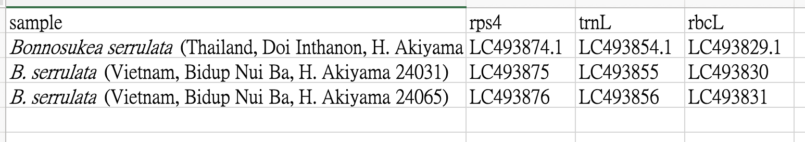

# NCBI gene data scraping

## How to Use
Before running the script, make sure to modify the following:

1. Set the data folder path
Change the working directory in your script:

```os.chdir("==your_path_here==")```

2. Specify the path of the input data file
The input file must be an Excel file (.xlsx), following the provided example format.



You can access NCBI here: https://www.ncbi.nlm.nih.gov/